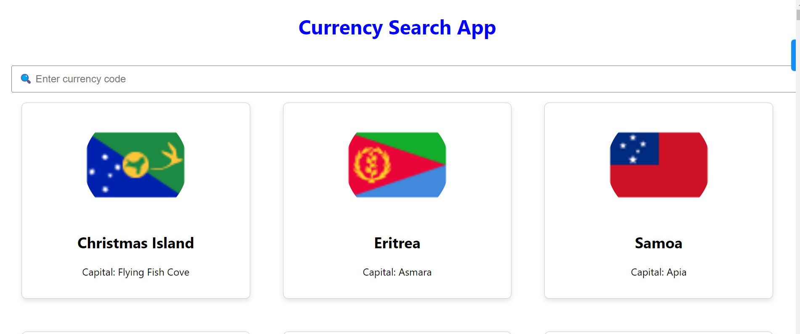

# MettaSocial

# Country Search App

A React application for searching and displaying country information based on currency codes.

## Introduction

The Country Search App is a simple React application that allows users to search for countries based on currency codes. It fetches data from the [Restcountries API](https://restcountries.com) and displays relevant information about each country.

## Features

- Search for countries by currency code
- View details such as country name, capital, and flag
- Responsive design for various screen sizes

Certainly! A good README file provides information about your project, how to set it up, and how to use it. Here's a basic template for a README file for your country search app:

markdown
Copy code
# Country Search App

A React application for searching and displaying country information based on currency codes.

## Table of Contents

- [Introduction](#introduction)
- [Features](#features)
- [Installation](#installation)

- [Technologies Used](#technologies-used)

## Introduction

The Country Search App is a simple React application that allows users to search for countries based on currency codes. It fetches data from the [Restcountries API](https://restcountries.com) and displays relevant information about each country.

## Features

- Search for countries by currency code
- View details such as country name, capital, and flag
- Responsive design for various screen sizes

# Technologies Used
React
Axios
Flags API

## LANDING PAGE

